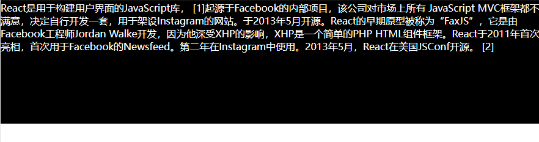

#### 一、先看效果



#### 二、实现思路

1、复制一层文字放在实际文字上  
2、通过控制上层文字的背景颜色的 **渐变属性的百分比** 实现文字逐渐展示的视觉效果  

#### 三、代码示例
1、html部分

``` html5
<div class="body">
    <div class='box'>
        <p>
            React是用于构建用户界面的JavaScript库， [1]起源于Facebook的内部项目，该公司对市场上所有 JavaScript MVC框架都不满意，决定自行开发一套，用于架设Instagram的网站。于2013年5月开源。React的早期原型被称为“FaxJS”，它是由Facebook工程师Jordan Walke开发，因为他深受XHP的影响，XHP是一个简单的PHP HTML组件框架。React于2011年首次亮相，首次用于Facebook的Newsfeed。第二年在Instagram中使用。2013年5月，React在美国JSConf开源。 [2]
        </p>
        <p class="p">
            <span class='text'>React是用于构建用户界面的JavaScript库， [1]起源于Facebook的内部项目，该公司对市场上所有 JavaScript MVC框架都不满意，决定自行开发一套，用于架设Instagram的网站。于2013年5月开源。React的早期原型被称为“FaxJS”，它是由Facebook工程师Jordan Walke开发，因为他深受XHP的影响，XHP是一个简单的PHP HTML组件框架。React于2011年首次亮相，首次用于Facebook的Newsfeed。第二年在Instagram中使用。2013年5月，React在美国JSConf开源。 [2]
            </span>
        </p>
    </div>
</div>
```

2、css样式
``` css

.body{
  background:#000000;
  height:200px
}
*{
  margin:0;
  padding:0;
}
.box{
  position:relative;
  color:#FFFFFF;
}
.p{
  position:absolute;
  inset: 0; 
}
@property --p{
  syntax:'<percentage>';
  initial-value:0%;
  inherits:false;
}
.text{
  background:linear-gradient(
    to right,
    transparent var(--p),
    #000000 calc(var(--p) + 10px));
    color:transparent;
  animation:erase 7s linear forwards;
}


@keyframes erase {
  to{
    --p:100%
  }
}
```

#### 四、重点部分

如果单纯的使用动画，并不能改变`--p`属性的值，但是在CSS中的`@property`功能，能够声明一个自定义属性，把自定义属性`--p`变成和`color`、`background`一样的属性  


语法示例
``` css
@property --property-name {
  syntax: "<color>";
  inherits: false;
  initial-value: #c0ffee;
}
```

其中 `syntax`和`inherits`字段是必填项。  
1、`syntax`声明自定义属性是什么类型的数据，比如颜色、百分比、字符串等
2、`inherits` 表示是否必须
3、`initial-value` 表示如果必填的默认值

[点击查看syntax属性的可选值](https://drafts.css-houdini.org/css-properties-values-api/#supported-names)
